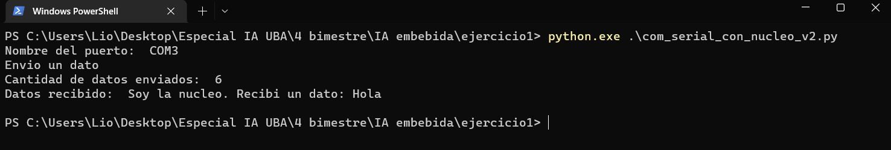

<h2>Referencia de archivos</h2>
 

1- Para el programa de la placa nucleo (Placa Nucleo F429ZI) se utilizó mbedOS online
    

   Hay 2 versiones de código, una primera que lee de a un caracter y una segunda que lee una línea completa:

  * En el archivo "main.cpp" está el código de la primera versión del ejercicio que recibe solo un caracter.
  * El bin generado está en el archivo "ComunicacionSerial.NUCLEO_F429ZI.bin"
  * El código implementado de la segunda versión está en el archivo "main_v2.cpp"
  * El bin generado está en el archivo "ComunicacionSerial_v2.NUCLEO_F429ZI.bin"

 
2- Para el programa python que se comunica con la nucleo se tiene este código:

   * serial_puerto.py: permite detectar el nombre del puerto serial en la PC, no forma parte del ejercicio.
   * com_serial_con_nucleo.py: programa para comunicarse con la versión que recibe un solo caracter en la nucleo (main.cpp).
   * com_serial_con_nucleo_v2.py: programa para comunicarse con la segunda versión de la nucleo que recibe una línea de texto completa (main_v2.cpp).

 
  

A continuación se muestra una imagen de la ejecución de la versión 2 del programa:

